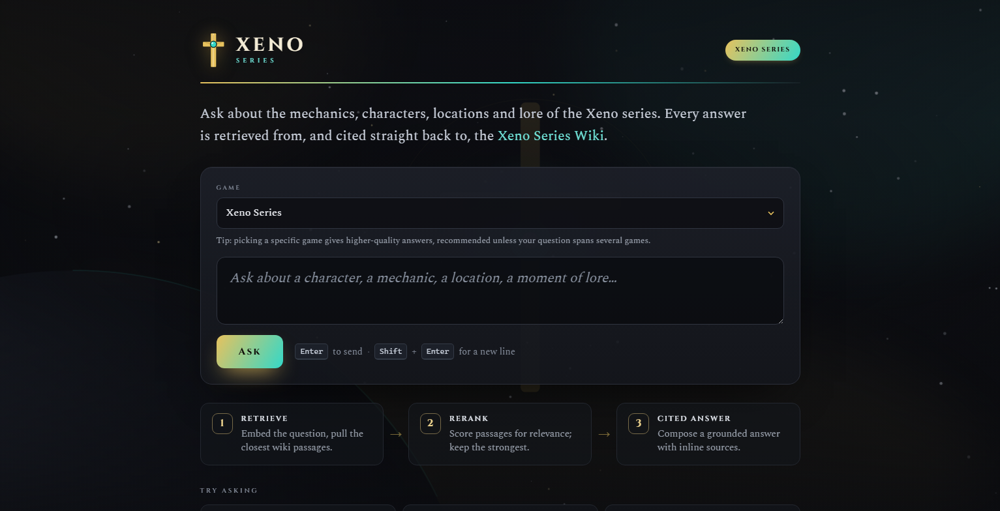
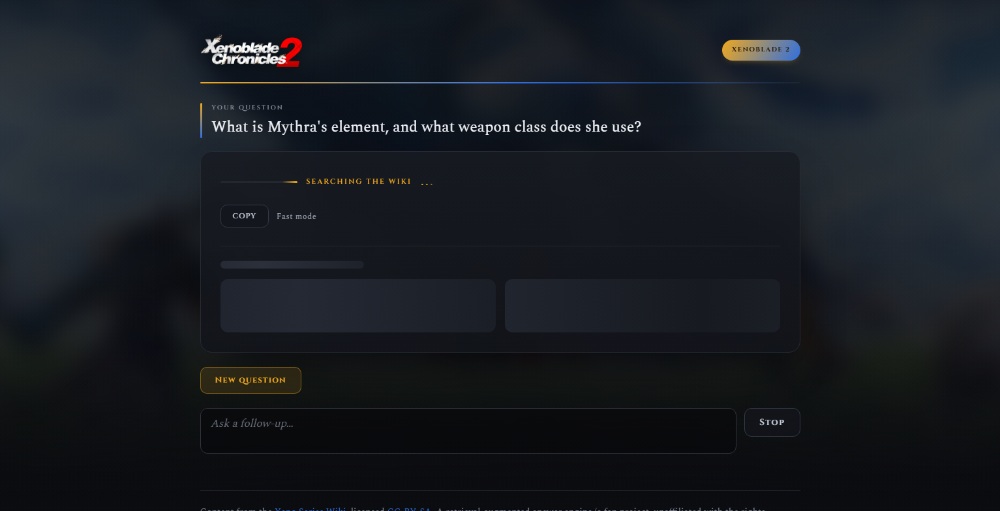
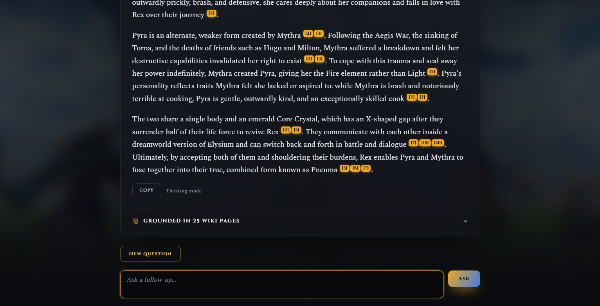
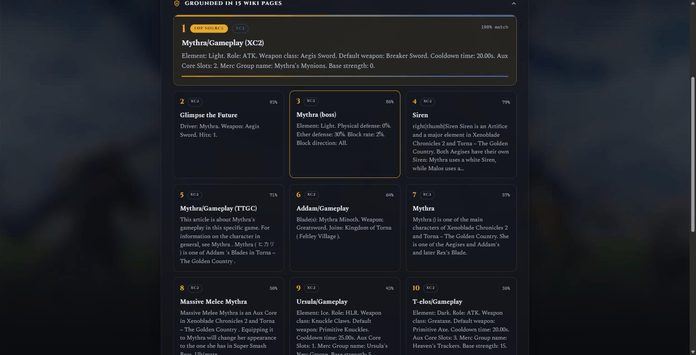
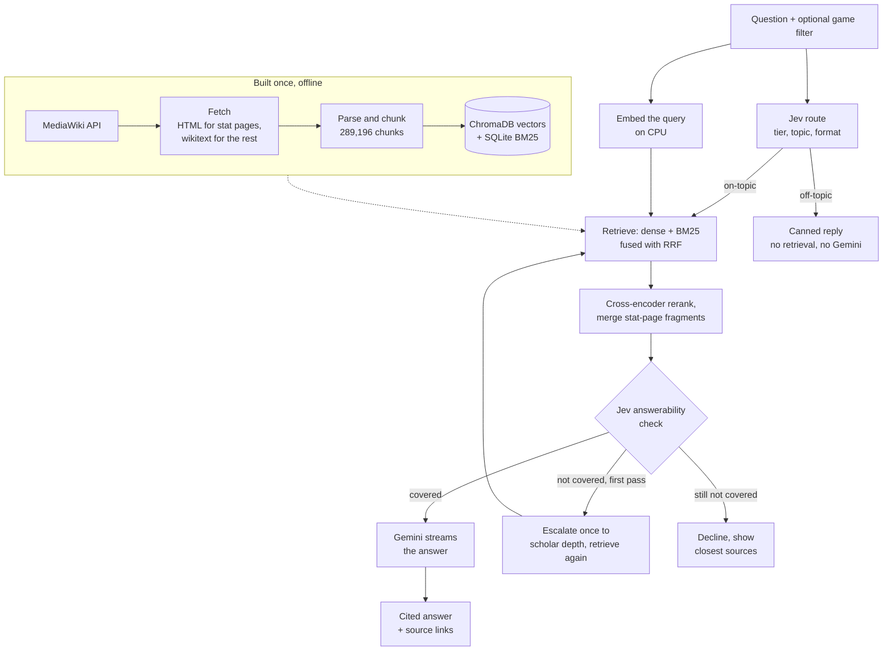
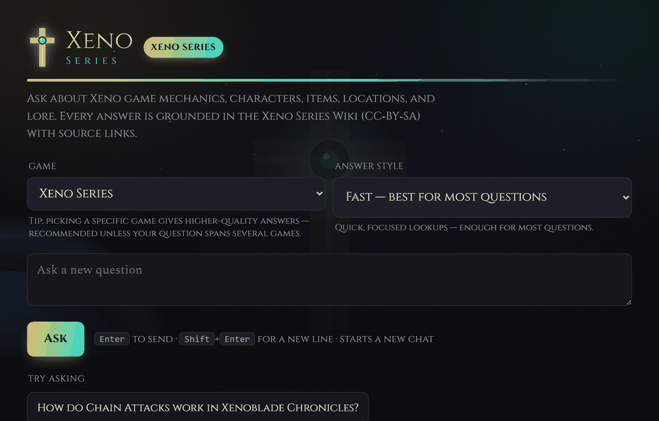

# Xeno Series Wiki RAG Chatbot

A retrieval-augmented question-answering system over the Xeno Series Wiki (Xenogears, Xenosaga
Episodes I to III, Xenoblade Chronicles 1/2/3/X), built end to end: a hybrid HTML and wikitext corpus,
dense plus BM25 retrieval with a cross-encoder reranker, automatic answer-tier routing and
answerability gates, and cited answers streamed to a web UI. Every answer links to the wiki pages it
used. Retrieval runs on your machine; Gemini writes the answer.

[](https://github.com/yib7/xeno-series-rag/actions/workflows/ci.yml)
[](https://www.python.org/downloads/)
[](LICENSE)
[](docs/LICENSE-DATA.md)

## Screenshots

<table>
<tr>
<td></td>
<td></td>
</tr>
<tr>
<td></td>
<td></td>
</tr>
</table>

## What it does

- Hybrid corpus: the wiki's stat tables are decoded by Lua modules and exist only in rendered HTML,
  so the 7,593 stat pages are fetched as HTML and the rest as wikitext. Result: 34,060 articles and
  289,196 chunks.
- Hybrid retrieval: `Qwen/Qwen3-Embedding-0.6B` vectors in ChromaDB and a SQLite FTS5 BM25 index,
  fused with Reciprocal Rank Fusion and reranked by a cross-encoder. BM25 recovers exact terms such as
  "mimeosomes" that embed poorly.
- Series-aware game filter: a game filter keeps results to that game plus series-wide pages, and
  relaxes itself when it would hide the page a question is about (shared Xenosaga cast).
- Automatic tier routing: Jev (TypeSafe AI's decision model) picks the answer tier for each
  question (fast, thinking or scholar), plus an answer format. The query embedding runs while the
  routing call is in flight. Details in [Answer tiers](#answer-tiers).
- Two gates: an off-topic question gets a canned reply with no retrieval and no Gemini call. After
  reranking, an answerability check escalates once to scholar depth, then declines and shows the
  closest sources if the wiki still does not cover the question.
- Streaming, cited answers: token-by-token over Server-Sent Events, inline `[n]` markers linked to
  numbered source cards, a Stop control that keeps the partial text, and per-game theming. A CLI is
  included.
- Measured: a 200-question gold set scores retrieval, and a 260-case live eval chose the gate
  thresholds. See [Evaluation](#evaluation).

## Tech stack

| Layer | Choice |
|---|---|
| Language and runtime | Python 3.12; Node 24 for the frontend tests |
| Retrieval | ChromaDB 1.5.9 (dense, cosine) + SQLite FTS5 (BM25), Reciprocal Rank Fusion |
| Embeddings | `Qwen/Qwen3-Embedding-0.6B` via sentence-transformers 6.1 and PyTorch 2.14 (CPU at query time; corpus embedded once on a Colab GPU) |
| Reranking | `cross-encoder/ms-marco-MiniLM-L-6-v2` |
| Routing and gates | Jev (TypeSafe AI, model `jev-latest`) called with httpx 0.28 |
| Generation | Google Gemini via google-genai 2.26: `gemini-3.5-flash-lite` (fast), `gemini-3.8-flash` (thinking, scholar) |
| Web | FastAPI 0.142 + uvicorn 0.54, Server-Sent Events, vanilla-JS frontend |
| Corpus | MediaWiki API (requests), BeautifulSoup + lxml for HTML, mwparserfromhell for wikitext |
| Tests and CI | pytest 9.1, node:test, ruff 0.16.10; GitHub Actions on Linux and Windows |

Versions are the pins in `requirements.txt` (the last clean install). `pip install -e ".[dev]"` accepts the ranges declared in `pyproject.toml`.

## How it works



Routing and the query embedding run concurrently. Without a Jev key the Jev steps are skipped: every
question runs at the `thinking` tier with no gates. A forced CLI tier skips the answerability check.
[docs/ARCHITECTURE.md](docs/ARCHITECTURE.md) has the module-level version of this diagram.

Why two fetch paths: the wiki's stat tables (Element, HP, weapon, resistances) are generated by Lua
modules that decode internal numeric codes (`Atr=7` becomes "Light") only when rendering HTML. They are
absent from raw wikitext, and no batch API returns them decoded. So the 7,593 pages with stat or data
templates are fetched as rendered HTML and parsed with BeautifulSoup, while the rest keep their clean
wikitext prose. To regenerate the corpus yourself instead of downloading it (many hours), see
[docs/BUILD_FROM_SCRATCH.md](docs/BUILD_FROM_SCRATCH.md).

## Setup

**You need:**

- Python 3.12 (pinned in `.python-version`; the ML wheels are most reliable there).
- About 3.5 GB of free RAM while the app runs (measured: 3.2 GB steady, 3.5 GB peak).
- About 2.2 GB of free disk for the vector store, which Step 4 downloads (just over 1 GB compressed),
  plus room for the Python packages and two open models fetched on the first question
  (`Qwen/Qwen3-Embedding-0.6B`, about 1.2 GB, and the reranker).
- A Gemini API key for live answers (free to create in
  [Google AI Studio](https://aistudio.google.com/apikey)); Step 6 adds it.
- Optional: a `TYPESAFE_API_KEY` for automatic answer-tier routing and the off-topic and coverage
  gates; Step 7 adds it. Without it everything still works: every question runs at the `thinking` tier
  with both gates off.
- Node 24 (pinned in `.nvmrc`) only if you want to run the frontend tests.

**Supported platforms:** Windows 11 (developed and tested locally) and Linux (the setup steps below
run on `ubuntu-latest` and `windows-latest` in CI). macOS is not tested and not claimed.

Run every command from the repository root.

**Step 1. Create a virtual environment.**

```bash
python3.12 -m venv .venv      # Windows: py -3.12 -m venv .venv
```

**Step 2. Activate it.** The later commands assume `python` is the project's interpreter.

```bash
source .venv/bin/activate     # Windows: .venv\Scripts\activate
```

On Windows, if PowerShell says running scripts is disabled, run
`Set-ExecutionPolicy -Scope Process RemoteSigned` (it affects only that window) and activate again.

**Step 3. Install the project and its dev tools.** This pulls PyTorch and the other ML packages, so
allow a few minutes.

```bash
pip install -e ".[dev]"
```

**Step 4. Download the prebuilt vector store.** The script downloads the release asset (just over 1 GB),
verifies its checksum, extracts it into `data/vectorstore/` (about 2.2 GB on disk) and rebuilds the BM25
index locally so it matches the shipped vectors. Re-run with `--force` to refresh. It uses the GitHub
CLI (`gh`) for a progress bar if you have it, and a plain HTTPS request otherwise.

```bash
python -m scripts.setup
```

**Step 5. Create your `.env` file.** It is gitignored and must never be committed.

```bash
cp .env.example .env          # Windows: copy .env.example .env
```

**Step 6. Add your Gemini key.** Open `.env` and replace the placeholder on the `GEMINI_API_KEY=` line
with your key. Without a key, retrieval and the whole test suite still work (the tests use a mock LLM),
but a question gets a "Gemini credentials not found" message instead of an answer.

**Step 7 (optional). Add your Jev key.** Skip this unless you want automatic routing. In `.env`,
remove the `#` from the `TYPESAFE_API_KEY=` line and paste your key (create one at
[docs.typesafe.ai](https://docs.typesafe.ai)). Jev picks the answer tier per question and gates
off-topic and uncovered questions; see [Answer tiers](#answer-tiers).

**Step 8. Start the web UI.**

```bash
python -m uvicorn xeno_rag.web.app:app --port 8000
```

**Step 9. Open <http://127.0.0.1:8000> and ask a question.** The first question loads the embedding
model and reranker, which takes several seconds; every question after it is faster. To load them at
startup instead, set `XENO_WARM=1` before Step 8.

**Step 10 (optional). Ask from the terminal instead.** Skip this if you use the web UI.

```bash
python -m xeno_rag.cli -q "How much power does Infinity Blade have?"
python -m xeno_rag.cli -q "Who is the protagonist?" --game XC2
python -m xeno_rag.cli -q "Compare the Vandhams across games" --tier scholar
```

### Serving notes

- `GET /health` reports store, index and version status without loading any model, for monitoring a
  long-running instance.
- The server answers only requests addressed to `localhost`, `127.0.0.1` or `[::1]`. To serve it under
  another name, set `XENO_ALLOWED_HOSTS` (see `.env.example`).
- Models, tiers, retrieval depth, gate thresholds and paths live in `config.yaml`.

## Answer tiers

Each question is auto-routed to a tier by Jev before retrieval. There is no tier selector in the UI.

| Tier | Gemini model | Retrieval depth | Built for |
|---|---|---|---|
| `fast` | `gemini-3.5-flash-lite` | 20 chunks, 5 per page | single-fact lookups |
| `thinking` | `gemini-3.8-flash` | 40 chunks, 6 per page | explanations and comparisons; also the fallback tier |
| `scholar` | `gemini-3.8-flash`, high thinking level | 96 chunks, 10 per page | broad, whole-series synthesis |

Routing needs `TYPESAFE_API_KEY` (Step 7). Without it every question uses the fallback tier,
`thinking`, with no off-topic gate and no coverage check. The CLI's `--tier` flag forces the tier
directly, but still asks Jev for the off-topic gate and format hint when a key is set. Live answers need
`GEMINI_API_KEY`. The values above are the shipped `config.yaml`.

## What leaves your machine

Retrieval, embedding and reranking run locally. Each question you ask is sent to Google (Gemini) to
generate the answer, along with the retrieved wiki passages and up to six earlier turns of the chat. If
you set `TYPESAFE_API_KEY`, the question text (plus the previous question and the chosen game) is also
sent to TypeSafe AI's Jev API to route it, and a few retrieved passages go there for the coverage check;
`router.provider: fixed` in `config.yaml` turns Jev off. Step 4 downloads the vector store from GitHub,
and the first question downloads two open models from Hugging Face; those requests carry no question
text. There is no telemetry or analytics. Details are in [SECURITY.md](docs/SECURITY.md).

## Demo



Recorded against the running app and the shipped vector store. The wait before the first token is sped up to about three seconds.

## Corpus

| Stage | Count |
|---|---|
| Titles harvested (`ns=0`, non-redirect) | 36,181 |
| Pages fetched as rendered HTML (stat and data templates) | 7,593 |
| Articles parsed (after dropping redirects, stubs, disambiguation) | 34,060 |
| Retrieval chunks (prose + infobox/stat-block sentences) | 289,196 |
| Embedding model | `Qwen/Qwen3-Embedding-0.6B` (1024-dim, cosine; instruction-tuned, last-token pooling) |
| Vector store | ChromaDB (persistent, local), shipped as a GitHub release asset |

## Evaluation

Retrieval: a hand-built gold set of 200 questions (25 per game across all 8 titles) covers
characters, enemy and boss stats, art and attack values, collectible locations, quests, lore, items and
mechanics. Each question has a documented answer and the wiki page that holds it
([eval/QUESTIONS.md](eval/QUESTIONS.md), [eval/gold_questions.json](eval/gold_questions.json)). The
harness runs the production retriever under each question's game filter and checks whether the gold
page is surfaced. The retriever surfaces the gold page for 200 of 200 questions across all 8 games, at
a mean rank of 1.3. The check is free (no LLM call).

```bash
python -m eval.run_gold_eval            # retrieval scoring against the 200-question gold set (free)
```

Gates: `eval/run_jev_gates_eval.py` replays the gold set plus 30 hand-written off-topic
questions, 20 questions the wiki does not cover, and 10 follow-ups through the real routing and
answerability code, then sweeps the confidence threshold. At the shipped 0.7:

| Measure | Result |
|---|---|
| Gold questions wrongly blocked as off-topic | 0 of 200 |
| Off-topic questions caught | 30 of 30 |
| Gold questions wrongly declined as not covered | 1 of 200 (0.5%) |
| Not-covered questions declined | 18 of 20 (90%; 80% at 0.8, 70% at 0.9) |
| Follow-ups blocked or declined | 0 of 10 |

That run is live and paid (about 570 Jev calls), so run it deliberately. Methodology is in [eval/](eval/) and
[docs/eval/](docs/eval/). The per-question result files are gitignored and regenerate when you run
the eval.

## Tests

```bash
pytest -q                  # offline unit and integration suite (no API key, no live calls)
node --test tests/js/*.test.mjs   # frontend renderer (also wrapped into the pytest run)
pytest -m live -q          # one real, throttled API smoke test (opt in)
ruff check .               # lint
```

The default suite has 615 Python tests and the frontend renderer has 55 more in Node's test runner. The
Python suite runs in about 20 seconds with stubbed Gemini and Jev calls. CI runs lint, both suites and
the real-embedder integration test on Linux and Windows, plus the Setup steps above on a clean runner.

## Limitations

- Needs a Gemini key: retrieval and the tests work without one, but a live answer does not.
  Gemini is a third-party service: the question and the retrieved passages leave your machine.
- Jev is optional and third-party: without a key every question runs at the `thinking` tier with no
  off-topic gate, no coverage check and no format hint. With one, the gates are tuned on small
  hand-written sets: at 0.7 the coverage check wrongly declines 0.5% of gold questions and catches
  about 90% of not-covered ones (18 of 20), so a few unanswerable questions still reach Gemini.
- Local, single user, no auth: the server binds to loopback and has a Host-header guard, a rate
  limit and input caps, but no login. Do not put it on an untrusted network; setting `XENO_ALLOWED_HOSTS`
  for another name is on you. There is no hosted demo.
- Resource cost: about 3.5 GB of RAM and 2.2 GB of disk. On a 12-core Windows desktop the CPU
  reranker makes retrieval take about 1.5 s (fast) to 3 s (scholar) per question once warm, before
  Gemini starts, and the first question takes about 9 s while models load (`XENO_WARM=1` moves that to
  startup).
- Scope: English wiki only, built for this one wiki's structure rather than as a general RAG
  toolkit. Tested on Windows 11 and Linux; macOS is not tested. The shipped store is a derived index,
  not a mirror of the wiki.
- Evaluation covers retrieval, not answer quality: the gold set checks that the right page is
  found; it does not grade the generated text. Non-mainline pages (anime, spinoffs, albums) fall back to
  a series-wide tag instead of a precise game filter, and a few topics with no single page (such as the
  Solaris caste hierarchy) rest on scattered context.
- Next: an LLM-graded answer-faithfulness eval over the same gold set, and a game tag for the
  non-mainline pages.

## Attribution and license

This project is dual-licensed, because it bundles two different kinds of thing:

- Code (the pipeline, web app, scripts, config) is MIT ([LICENSE](LICENSE)).
- Wiki-derived data (the corpus and embeddings in the release asset, the `tests/fixtures/` wiki
  text and HTML, parsed articles, chunks, and generated answers) is CC BY-SA 4.0
  ([LICENSE-DATA.md](docs/LICENSE-DATA.md)), the same license the
  [Xeno Series Wiki](https://www.xenoserieswiki.org) uses. Share-alike requires anything derived from
  that content to stay CC BY-SA.

Every answer surfaces the source page URLs it relied on, satisfying the attribution requirement in the
output itself. Data was pulled through the MediaWiki API (not an HTML scraper) with a descriptive
User-Agent, `maxlag=5`, serial requests, and a configurable delay, out of respect for a small,
donation-funded fan wiki.

### Game artwork, logos, and trademarks

No official game artwork, logo, key art, or box art file is included in this repository. Those assets
are the property of their respective owners (Nintendo, Monolith Soft, Bandai Namco Entertainment, and
Square Enix), and all rights are reserved to them. The per-game logo and key-art files the UI can
display are fetched locally by `scripts/fetch_art.py`, are git-ignored, and are never redistributed
here. When they are absent the UI falls back to styled text wordmarks, so the app runs fully without
them. The one exception is the screenshots and demo GIF above, which capture the running UI and show
the Xenoblade Chronicles 2 logo and background as rendered locally; they illustrate the interface and
nothing else.

This is an unofficial, non-commercial fan project. It is not affiliated with, endorsed by, or sponsored
by any of those rights holders. Game and series names are trademarks of their respective owners and are
used here only for identification and descriptive purposes.

Security notes (posture, input handling, dependency audit) are in [SECURITY.md](docs/SECURITY.md). Third-party
credits and font licenses are in [CREDITS.md](docs/CREDITS.md); release history is in
[CHANGELOG.md](docs/CHANGELOG.md).
