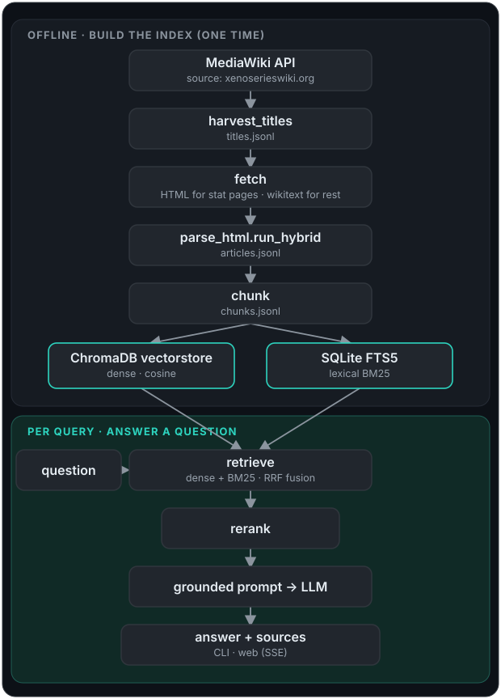

# Xeno Series Wiki RAG Chatbot

A local-first Retrieval-Augmented Generation chatbot that answers natural-language questions about the
[Xeno Series](https://www.xenoserieswiki.org) games (Xenogears, Xenosaga 1 to 3, Xenoblade Chronicles
1/2/3/X), grounded in wiki content with a source link on every answer.

[](https://github.com/yib7/xeno-series-rag/actions/workflows/ci.yml)
[](https://www.python.org/downloads/)
[](LICENSE)
[](docs/LICENSE-DATA.md)

## Screenshots

<table>
<tr>
<td></td>
<td></td>
</tr>
<tr>
<td></td>
<td></td>
</tr>
</table>

This is a complete RAG system built end to end, not a thin wrapper around an API. It pulls ~36k wiki
articles through the MediaWiki API, parses both rendered HTML (for Lua-decoded stat tables) and
wikitext (for prose), chunks and embeds them locally, and serves answers through a hybrid retriever
(dense vectors plus lexical BM25, fused and reranked) behind a streaming web UI and a CLI. The LLM is
pluggable; everything up to generation runs and is tested without any API key.

## Tech stack

| Layer | Choice |
|---|---|
| Language / runtime | Python 3.12 |
| Retrieval | ChromaDB (dense, cosine) + SQLite FTS5 (lexical BM25), fused with Reciprocal Rank Fusion |
| Embeddings | `Qwen/Qwen3-Embedding-0.6B` via sentence-transformers (CPU query embedding; corpus indexed once on a Colab GPU) |
| Reranking | `cross-encoder/ms-marco-MiniLM-L-6-v2` |
| Generation | Google Gemini via `google-genai`, behind a provider-agnostic adapter (mockable) |
| Web | FastAPI + Server-Sent Events, vanilla-JS frontend with per-game theming |
| Data source | MediaWiki API (not an HTML scraper), with API etiquette baked in |
| Tests | pytest (Python) + node:test (frontend renderer) |

## What it does

- **Grounded answers with inline citations:** every answer is built only from retrieved wiki context.
  Inline `[n]` markers link each claim to a numbered source card, and every source page URL is
  surfaced, so answers are checkable against the wiki.
- **Hybrid retrieval:** dense embedding vectors catch paraphrase and meaning; a lexical BM25 index catches
  exact proper nouns and rare terms. The two are fused with Reciprocal Rank Fusion, then a
  cross-encoder reranks the result. This fixed the class of failure where an exact term (for example
  "mimeosomes") embedded poorly and returned nothing useful. The dense side uses
  `Qwen/Qwen3-Embedding-0.6B`, an instruction-tuned decoder embedder: queries are prefixed with a short
  `"Instruct: …\nQuery:"` task instruction while documents are embedded plain. That asymmetric
  query/document split is the convention the model was trained for.
- **Series-aware game filtering:** most wiki pages carry no `(XCn)` title suffix, so they are tagged
  `series` and surface under every game. Picking a game retrieves that game's pages plus the shared
  `series` bucket, with a multi-tag membership schema so cross-appearance characters resolve to their
  home games.
- **Automatic answer-tier routing:** each question is routed to one of three tiers, fast, thinking,
  or scholar, by Jev, TypeSafe AI's decision model, which returns a typed choice instead of generated
  text. Each tier pairs a Gemini model with a retrieval depth, so how hard the model reasons and how
  much of the wiki it reads scale together. The query embedding runs concurrently with that routing
  call rather than after it. The same Jev call also gates and shapes the answer: a question judged
  off-topic (not about the Xeno series) gets a canned reply with no retrieval or Gemini call; a picked
  format (table, list, or prose) steers the answer's shape; and after rerank, a separate answerability
  check judges whether the (merged) retrieved chunks actually cover the question — if not, retrieval
  escalates once to Scholar depth, and if that still doesn't cover it the bot says the wiki doesn't
  seem to cover it and shows the closest sources instead of guessing. Routing plus the coverage check
  together cost about $0.0002 per on-topic question, measured by the gate eval. Without
  a `TYPESAFE_API_KEY`, or if Jev is unavailable, every question uses the fallback tier with no gate,
  no format hint, and no answerability check — today's behaviour. There is no tier selector in the UI;
  the CLI can still force a tier with `--tier` (Jev is still asked for topic/format when a key is set).
- **Per-game theming:** selecting a game re-themes the page with that game's palette, logo, display
  font, and a faded key-art background.

## Corpus (this build)

| Stage | Count |
|---|---|
| Titles harvested (`ns=0`, non-redirect) | 36,181 |
| Articles parsed (after dropping redirects, stubs, disambiguation) | 34,060 |
| Retrieval chunks (prose + infobox/stat-block sentences) | 289,196 |
| Embedding model | `Qwen/Qwen3-Embedding-0.6B` (1024-dim, cosine; instruction-tuned, last-token pooling) |
| Vector store | ChromaDB (persistent, local) |

## Setup

**You need:**

- Python 3.12 (pinned in `.python-version`; the ML wheels are most reliable there).
- About 3.5 GB of free RAM while the app runs (measured: 3.2 GB steady, 3.5 GB peak).
- About 2.2 GB of free disk for the vector store, which Step 4 downloads (just over 1 GB compressed),
  plus room for the Python packages and two open models fetched on the first question
  (`Qwen/Qwen3-Embedding-0.6B`, about 1.2 GB, and the reranker).
- A Gemini API key for live answers (free to create in
  [Google AI Studio](https://aistudio.google.com/apikey)); Step 6 adds it.
- Optional: a `TYPESAFE_API_KEY` for automatic answer-tier routing and the off-topic and coverage
  gates; Step 7 adds it. Without it everything still works: every question runs at the `thinking` tier
  with both gates off.
- Node 24 (pinned in `.nvmrc`) only if you want to run the frontend tests.

**Supported platforms:** Windows 11 (developed and tested locally) and Linux (the setup steps below
run on `ubuntu-latest` and `windows-latest` in CI). macOS is not tested and not claimed.

Run every command from the repository root.

**Step 1. Create a virtual environment.**

```bash
python3.12 -m venv .venv      # Windows: py -3.12 -m venv .venv
```

**Step 2. Activate it.** The later commands assume `python` is the project's interpreter.

```bash
source .venv/bin/activate     # Windows: .venv\Scripts\activate
```

**Step 3. Install the project and its dev tools.** This pulls PyTorch and the other ML packages, so
allow a few minutes.

```bash
pip install -e ".[dev]"
```

**Step 4. Download the prebuilt vector store.** The script downloads the release asset (just over 1 GB),
verifies its checksum, extracts it into `data/vectorstore/` (about 2.2 GB on disk) and rebuilds the BM25
index locally so it matches the shipped vectors. Re-run with `--force` to refresh. It uses the GitHub
CLI (`gh`) for a progress bar if you have it, and a plain HTTPS request otherwise.

```bash
python -m scripts.setup
```

**Step 5. Create your `.env` file.** It is gitignored and must never be committed.

```bash
cp .env.example .env          # Windows: copy .env.example .env
```

**Step 6. Add your Gemini key.** Open `.env` and replace the placeholder on the `GEMINI_API_KEY=` line
with your key. Without a key, retrieval and the whole test suite still work (the tests use a mock LLM),
but a question gets a "Gemini credentials not found" message instead of an answer.

**Step 7 (optional). Add your Jev key.** Skip this unless you want automatic routing. In `.env`,
remove the `#` from the `TYPESAFE_API_KEY=` line and paste your key (create one at
[docs.typesafe.ai](https://docs.typesafe.ai)). Jev picks the answer tier per question and gates
off-topic and uncovered questions; see [Answer tiers](#answer-tiers).

**Step 8. Start the web UI.**

```bash
python -m uvicorn xeno_rag.web.app:app --port 8000
```

**Step 9. Open <http://127.0.0.1:8000> and ask a question.** The first question loads the embedding
model and reranker, which takes several seconds; every question after it is faster. To load them at
startup instead, set `XENO_WARM=1` before Step 8.

**Step 10 (optional). Ask from the terminal instead.** Skip this if you use the web UI.

```bash
python -m xeno_rag.cli -q "How much power does Infinity Blade have?"
python -m xeno_rag.cli -q "Who is the protagonist?" --game XC2
python -m xeno_rag.cli -q "Compare the Vandhams across games" --tier scholar
```

The web UI has token-by-token streaming, a game filter, per-game theming, a Stop control that halts a
running answer while keeping the partial text, inline citation markers, and client-side Markdown
rendering. For a long-running deployment, poll `GET /health` for store, index, and version status. The
server only answers requests addressed to `localhost`, `127.0.0.1` or `[::1]`; to serve on another
name, set `XENO_ALLOWED_HOSTS` (see `.env.example`). Models, tiers, retrieval depth and paths live in
`config.yaml`.

### Answer tiers

Each question is auto-routed to a tier by Jev before retrieval: `fast` uses `gemini-3.5-flash-lite`;
`thinking` and `scholar` both use `gemini-3.8-flash`, with scholar reasoning at Gemini's high thinking
level and reading a much deeper retrieval pool (built for broad, whole-series questions, and overkill
for simple lookups). Routing needs `TYPESAFE_API_KEY` (Step 7); without it every question uses the
fallback tier, `thinking`, with no off-topic gate and no coverage check. The CLI's `--tier` flag forces
the tier directly, but still asks Jev for the off-topic gate and format hint when a key is set. Live
answers need `GEMINI_API_KEY`.

### What leaves your machine

Retrieval, embedding and reranking run locally. Each question you ask is sent to Google (Gemini) to
generate the answer, along with the retrieved wiki passages and up to six earlier turns of the chat. If
you set `TYPESAFE_API_KEY`, the question text (plus the previous question and the chosen game) is also
sent to TypeSafe AI's Jev API to route it, and a few retrieved passages go there for the coverage check;
`router.provider: fixed` in `config.yaml` turns Jev off. Step 4 downloads the vector store from GitHub,
and the first question downloads two open models from Hugging Face; those requests carry no question
text. There is no telemetry or analytics. Details are in [SECURITY.md](docs/SECURITY.md).

## Demo


## How it works

<p align="center">
  
</p>

The path down to the two stores is built once, offline; everything from `question` onward runs per query.

**Why two fetch paths.** The wiki's stat tables (Element, HP, weapon, resistances) are generated by Lua
modules that decode internal numeric codes (`Atr=7` becomes "Light") only when rendering HTML; they are
absent from raw wikitext, and no batch API returns them decoded. So the ~7,593 pages with stat/data
templates are fetched as rendered HTML and parsed with BeautifulSoup, while the rest keep their clean
wikitext prose. To regenerate the corpus yourself instead of downloading it (several hours), see
[docs/BUILD_FROM_SCRATCH.md](docs/BUILD_FROM_SCRATCH.md).

For a deeper walkthrough of the modules and data flow, see [docs/ARCHITECTURE.md](docs/ARCHITECTURE.md).

## Evaluation

Retrieval quality is measured against a hand-built **gold question set of 200 questions (25 per game
across all 8 Xeno titles)**, with a deliberate spread of categories: characters, enemy and boss stats,
art and attack values, collectible locations, quests, world and lore, items, and mechanics. Every
question has a documented correct answer grounded in the indexed corpus and linked to its source wiki
page. The full set is human-readable in [eval/QUESTIONS.md](eval/QUESTIONS.md) (machine-readable
[eval/gold_questions.json](eval/gold_questions.json)).

The harness scores the production hybrid retriever (dense `Qwen/Qwen3-Embedding-0.6B` + lexical BM25,
RRF-fused and cross-encoder reranked) on whether the gold source page is surfaced under each
question's game filter. This "source-page hit rate" is free (no LLM call) and is exactly the signal a
retrieval change moves. On the current gold set the retriever finds the correct grounding page for
**all 200 questions across all 8 games (100%)**. Methodology and the per-question breakdown are in
[eval/](eval/) and [docs/eval/](docs/eval/).

```bash
python -m eval.run_gold_eval            # retrieval scoring against the 200-question gold set (free)
```

The off-topic gate and answerability check (above) are validated separately with
`python -m eval.run_jev_gates_eval`, which routes and grounds the gold set plus a hand-written
off-topic/not-covered case file to measure false-block, false-decline, and catch rates and sweep
threshold options. Unlike the retrieval eval, this makes **live, paid Jev calls** — about 550 for a
full run (gold set + negatives) — so run it deliberately, not as part of routine testing.

## Tests

```bash
pytest -q                  # offline unit and integration suite (no API key, no live calls)
node --test tests/js/*.test.mjs   # frontend renderer (also wrapped into the pytest run)
pytest -m live -q          # one real, throttled API smoke test (opt in)
ruff check .               # lint
```

## Attribution and license

This project is dual-licensed, because it bundles two different kinds of thing:

- **Code** (the pipeline, web app, scripts, config) is **MIT** ([LICENSE](LICENSE)).
- **Wiki-derived data** (the corpus and embeddings in the release asset, the `tests/fixtures/` wiki
  text and HTML, parsed articles, chunks, and generated answers) is **CC BY-SA 4.0**
  ([LICENSE-DATA.md](docs/LICENSE-DATA.md)), the same license the
  [Xeno Series Wiki](https://www.xenoserieswiki.org) uses. Share-alike requires anything derived from
  that content to stay CC BY-SA.

Every answer surfaces the source page URLs it relied on, satisfying the attribution requirement in the
output itself. Data was pulled through the MediaWiki API (not an HTML scraper) with a descriptive
User-Agent, `maxlag=5`, serial requests, and a configurable delay, out of respect for a small,
donation-funded fan wiki.

### Game artwork, logos, and trademarks

No official game artwork, logo, key art, or box art file is included in this repository. Those assets
are the property of their respective owners (Nintendo, Monolith Soft, Bandai Namco Entertainment, and
Square Enix), and all rights are reserved to them. The per-game logo and key-art files the UI can
display are fetched locally by `scripts/fetch_art.py`, are git-ignored, and are never redistributed
here. When they are absent the UI falls back to styled text wordmarks, so the app runs fully without
them. The one exception is the screenshots and demo GIF above, which capture the running UI and show
the Xenoblade Chronicles 2 logo and background as rendered locally; they illustrate the interface and
nothing else.

This is an unofficial, non-commercial fan project. It is not affiliated with, endorsed by, or sponsored
by any of those rights holders. Game and series names are trademarks of their respective owners and are
used here only for identification and descriptive purposes.

Security notes (posture, input handling, dependency audit) are in [SECURITY.md](docs/SECURITY.md). Third-party
credits and font licenses are in [CREDITS.md](docs/CREDITS.md); release history is in
[CHANGELOG.md](docs/CHANGELOG.md).

## Limitations

- Local-only: no hosted demo. The app binds `127.0.0.1` and runs on your machine, so there is no live
  URL to try it from.
- Purpose-built, not a framework: parsing, chunking, and tagging are shaped around this one wiki's
  structure, not a general-purpose RAG toolkit you can point at another site.
- No wiki mirror or bulk redistribution: the shipped store is a derived, embedded index for answering
  questions, not a redistributable copy of the wiki's raw content.
- A few narrow gaps: non-mainline media pages (anime, spinoffs, albums) fall back to a series-wide tag
  instead of a precise game filter; a handful of topics with no single wiki page to consolidate them
  (for example the Solaris caste hierarchy) lean on scattered context; the `eval/analyze.py` dev script
  hits a Windows-console encoding error on non-ASCII output.
