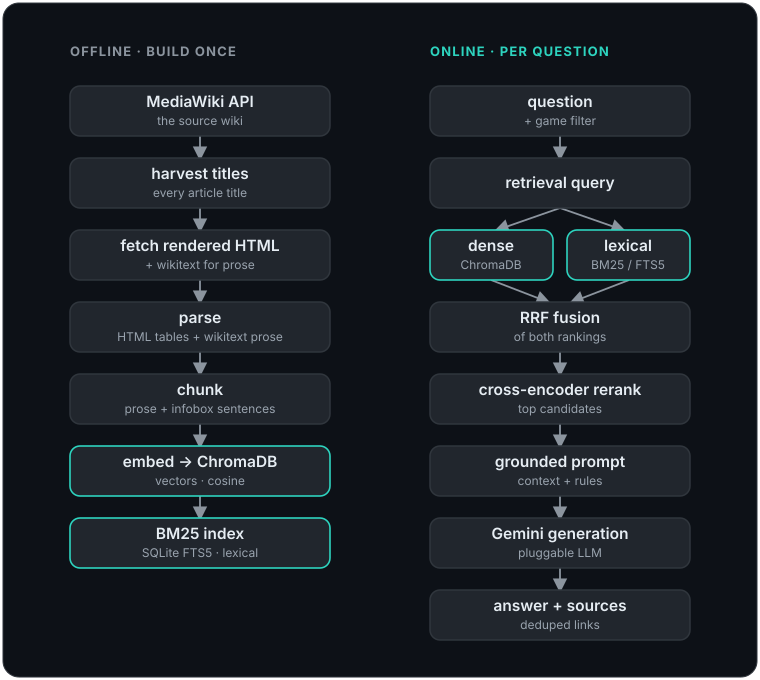

# Architecture

A newcomer's map of how this RAG chatbot works, end to end. Two halves: an **offline corpus build**
that turns the Xeno Series Wiki into a searchable index, and an **online query path** that answers a
question against that index with a cited, grounded response.

## The big picture

  

The build is a linear pipeline where every stage reads the previous stage's on-disk artifact, so each
stage is independently runnable, resumable, and testable. The query path is a single function
(`rag.answer` / `rag.answer_stream`) composed from the retrieval, rerank, and generation modules.

## Offline: the corpus build

Driven by `xeno_rag/pipeline.py` (`python -m xeno_rag.pipeline all`). Steps, in order:

1. **harvest** (`harvest_titles.py`) lists every `ns=0` article title via `list=allpages`, paginating
   on `apcontinue`.
2. **fetch** (`fetch_html.py`) pulls each page's *rendered* HTML through `action=parse`. Rendered HTML
   is used because the wiki's stat and data tables are produced by Lua modules: the raw wikitext only
   holds template calls, so the actual decoded values (stats, drops, resistances) exist only after the
   server renders them. Wikitext is still kept for prose-heavy pages.
3. **parse** (`parse_html.py`, `parse_wikitext.py`) runs a hybrid parse: HTML table extraction for
   stat/data pages, wikitext prose extraction for the rest, merged into one article record per page.
   Infobox and data templates become structured field maps; prose is split by `==` headings.
4. **chunk** (`chunk.py`) produces two chunk kinds: prose chunks (one per section, split to a token
   budget with overlap, prefixed with a `"[XC3] Title > Heading"` breadcrumb) and infobox chunks
   (structured fields rendered into natural-language sentences). Every chunk carries
   `chunk_id, pageid, title, game, heading, url`.
5. **embed** (`embed_index.py`) encodes chunk text with `Qwen/Qwen3-Embedding-0.6B` (a 1024-dim decoder
   embedder with last-token pooling, so the tokenizer is left-padded) and writes vectors, metadata, and
   text to a persistent ChromaDB collection (cosine space). The one-time corpus indexing runs on a GPU
   (Colab); at serve time a single query embeds on CPU in well under a second. Embedding is asymmetric:
   an `"Instruct: …\nQuery:"` instruction is prepended only to queries at search time, never to stored
   documents, the convention Qwen3-Embedding was trained on. This instruction is the `query_instruction`
   field in `config.yaml`. **It MUST match, character-for-character, the instruction used to embed the
   corpus on Colab**. The store is built there, served here, and a mismatch silently lands query and
   document vectors in different spaces (retrieval quietly degrades, no error). Treat it as a build
   invariant: change it in one place and you must re-embed.
6. **bm25** (`bm25_index.py`) builds a lexical SQLite FTS5 index over the same embedded collection, so
   its document set and game tags match the dense index exactly.

A full live pull is large (~36k articles, roughly 19h at the throttle) and is gated behind an explicit
command. Fetching is checkpointed per batch, so a crash or sleep resumes without re-fetching.
`scripts/run_fetch_durable.py` wraps the long pull in a self-healing scheduled task that survives
Windows Modern Standby. The prebuilt index is published as a GitHub release asset so most users never
run the pull at all (see `scripts/setup.py`).

## Online: the query path

`rag.answer(question, cfg, game_filter=...)` composes these steps:

1. **Retrieval query** (`rag._retrieval_query`) optionally folds in the previous question for
   conversational follow-ups, without polluting retrieval with the whole session.
2. **Hybrid retrieval** (`retrieve.py`) runs two independent searches: dense nearest-neighbour over
   ChromaDB and lexical BM25 over the FTS5 index, then fuses their rankings with Reciprocal Rank
   Fusion. Lexical recall fixes the case where an exact proper noun (a boss name, a mechanic) embeds
   poorly but matches a keyword cleanly. A `game` metadata filter scopes results to a selected game
   plus series-wide pages.
3. **Rerank** (`rerank.py`) reorders the fused candidates with a `cross-encoder/ms-marco-MiniLM-L-6-v2`
   model and attaches a relevance score, which the web UI turns into size-tiered source bubbles.
4. **Prompt** (`rag.build_prompt`) assembles a grounded prompt: answer only from the retrieved context,
   say so when the context is insufficient, prefer infobox chunks for stats, and cite sources.
5. **Generation** (`rag.GeminiClient`) calls the LLM behind a small adapter interface. Tests use a
   deterministic `MockLLM` and never touch the network. Credentials are read from the environment at
   call time.

### Answer styles

The web selector and CLI `--model` flag expose three tiers, each pairing a Gemini model with a
retrieval depth (configured in `config.yaml` under `answer_styles`):

- **Fast** (`gemini-3.1-flash-lite`): lean retrieval for quick, focused lookups.
- **Thinking** (`gemini-3.5-flash`): wider candidate pools and more kept chunks for multi-topic
  questions.
- **Scholar** (`gemini-3.1-pro-preview`): the deepest profile, built for broad cross-game synthesis.

The backend keeps a strict allowlist, so only these model ids reach the API. An unlisted model falls
back to the base retrieval depth.

### Game tagging

Most wiki pages have no `(XCn)` title suffix, so they are tagged `series` (recurring characters,
bosses, lore) and surface under every game filter. Pages that clearly belong to one or more games
carry those game tags. Cross-subseries cameo characters use a multi-tag membership schema so, for
example, KOS-MOS resolves to her home games rather than leaking into an unrelated filter.

## Web app

`xeno_rag/web/app.py` is a FastAPI app.

`/ask` streams the answer token by token over Server-Sent Events; a `sources` event carries the
deduped, relevance-scored source list. Generation is cancellable end to end: the browser drives the
fetch with an `AbortController` (the Ask button becomes a Stop control mid-stream and keeps the partial
answer), and the server checks `request.is_disconnected()` between chunks, so a stopped request also
stops pulling from the paid model stream.

`/health` is a cheap monitoring target: a directory stat, a read-only chunk count, and the BM25 row
count, returned as an always-200 JSON body that reports `degraded` instead of crashing when the store
or index is missing. An optional `XENO_WARM=1` startup hook loads the heavy retrieval singletons
(embedder, reranker, ChromaDB, BM25) at boot instead of inside the first question.

The static frontend (`web/static/index.html` + `render.js`) provides a question box, a game selector
that re-themes the page per game (palette, logo, display font, key-art wash), size-tiered source
bubbles, and client-side Markdown rendering. Inline `[n]` markers in an answer become superscript links
to the matching numbered source cards. The renderer is unit-tested with Node's test runner
(`tests/js/`), wrapped into the pytest suite so the browser-side logic is covered too.

## Module map

| Module | Responsibility |
|---|---|
| `api_client.py` | MediaWiki session: User-Agent, `maxlag`, serial requests, 429/maxlag backoff |
| `harvest_titles.py` | Enumerate all article titles |
| `fetch_html.py` / `fetch_content.py` | Pull rendered HTML / wikitext, checkpointed |
| `parse_html.py` / `parse_wikitext.py` | Hybrid parse to article records |
| `chunk.py` | Prose + infobox chunking with breadcrumbs |
| `embed_index.py` | Qwen3-Embedding vectors into ChromaDB (CPU; DirectML for encoder models) |
| `bm25_index.py` | SQLite FTS5 lexical index |
| `retrieve.py` | Dense + BM25 retrieval, RRF fusion, game filter |
| `rerank.py` | Cross-encoder reranking + relevance scores |
| `rag.py` | Retrieval query, prompt build, LLM adapter, answer styles |
| `config.py` | YAML config + `.env` loading |
| `pipeline.py` | Build orchestrator (harvest -> ... -> bm25) |
| `cli.py` | Command-line question interface |
| `web/app.py` | FastAPI + SSE server |

## Data and configuration

Everything tunable lives in `config.yaml`: API etiquette, embed model and device, vectorstore path,
retrieval depths, and the hybrid/rerank toggles. All build artifacts (`data/raw`, `data/processed`,
`data/vectorstore`) are gitignored; they are pulled or derived, never committed. The only secret is the
Gemini API key, read from `.env` (see `.env.example`).

## Testing

Every module is unit-tested against fixtures and mocks, with no live API or LLM calls in the default
suite (`pytest -m 'not live'`). Fixtures cover wikitext and rendered-HTML parsing, chunking, embedding
into a temporary Chroma collection, hybrid retrieval, reranking, the grounded prompt, the CLI, and the
FastAPI endpoint. The frontend renderer has its own Node test suite, run from within pytest.
