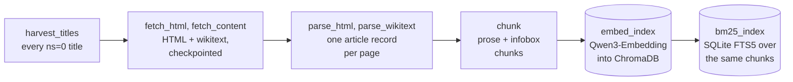
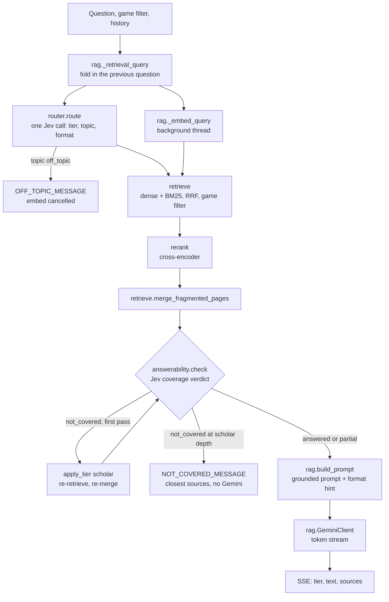

# Architecture

A newcomer's map of how this RAG chatbot works, end to end. Two halves: an offline corpus build
that turns the Xeno Series Wiki into a searchable index, and an online query path that answers a
question against that index with a cited, grounded response.

## The big picture

The offline build above runs once. The online path below runs for every question, from `rag.answer_stream`:

Retrieval reads the ChromaDB and BM25 stores the build produces. The two Jev steps (routing and the
answerability check) run only when a key is set (see "Answer tiers, routing, and gates"); without one,
routing falls back to the `thinking` tier and the flow goes from rerank and merge straight to the prompt.

The build is a linear pipeline where every stage reads the previous stage's on-disk artifact, so each
stage can be run, resumed, or tested on its own. The query path is a single function
(`rag.answer` / `rag.answer_stream`) composed from the retrieval, rerank, and generation modules.

## Offline: the corpus build

Run through `xeno_rag/pipeline.py` (`python -m xeno_rag.pipeline all`). Steps, in order:

1. harvest (`harvest_titles.py`) lists every `ns=0` article title via `list=allpages`, paginating
   on `apcontinue`.
2. fetch (`fetch_html.py`) pulls each page's *rendered* HTML through `action=parse`. Rendered HTML
   is used because the wiki's stat and data tables are produced by Lua modules: the raw wikitext only
   holds template calls, so the actual decoded values (stats, drops, resistances) exist only after the
   server renders them. Wikitext is still kept for prose-heavy pages.
3. parse (`parse_html.py`, `parse_wikitext.py`) runs a hybrid parse: HTML table extraction for
   stat/data pages, wikitext prose extraction for the rest, merged into one article record per page.
   Infobox and data templates become structured field maps; prose is split by `==` headings.
4. chunk (`chunk.py`) produces two chunk kinds: prose chunks (one per section, split to a token
   budget with overlap, prefixed with a `"[XC3] Title > Heading"` breadcrumb) and infobox chunks
   (structured fields rendered into natural-language sentences). Every chunk carries
   `chunk_id, pageid, title, game, heading, url`.
5. embed (`embed_index.py`) encodes chunk text with `Qwen/Qwen3-Embedding-0.6B` (a 1024-dim decoder
   embedder with last-token pooling, so the tokenizer is left-padded) and writes vectors, metadata, and
   text to a persistent ChromaDB collection (cosine space). The one-time corpus indexing runs on a GPU
   (Colab); at serve time a single query embeds on CPU in well under a second. Embedding is asymmetric:
   an `"Instruct: <task>\nQuery:"` instruction is prepended only to queries at search time, never to stored
   documents, the convention Qwen3-Embedding was trained on. This instruction is the `query_instruction`
   field in `config.yaml`. **It must match, character for character, the instruction used to embed the
   corpus on Colab.** The store is built there and served here, and a mismatch puts query and document
   vectors in different spaces: retrieval degrades with no error. Treat it as a build invariant.
   Changing it means re-embedding the corpus.
6. bm25 (`bm25_index.py`) builds a lexical SQLite FTS5 index over the same embedded collection, so
   its document set and game tags match the dense index exactly.

A full live pull is large (~36k articles, roughly 19h at the throttle) and is gated behind an explicit
command. Fetching is checkpointed per batch, so a crash or sleep resumes without re-fetching.
`scripts/run_fetch_durable.py` wraps the long pull in a self-healing scheduled task that survives
Windows Modern Standby. The prebuilt index is published as a GitHub release asset so most users never
run the pull at all (see `scripts/setup.py`).

## Online: the query path

`rag.answer(question, cfg, game_filter=...)` composes these steps:

1. Retrieval query (`rag._retrieval_query`) optionally folds in the previous question for
   conversational follow-ups, without polluting retrieval with the whole session. Its embedding is
   submitted to a small background `ThreadPoolExecutor` immediately, running concurrently with the Jev
   routing call below rather than after it; retrieval then awaits that future instead of embedding
   again.
2. Routing and gates (`router.route`, see "Answer tiers, routing, and gates" below) picks the tier
   and, from the same Jev call, a topic and a format. An off-topic topic short-circuits here: the
   canned `OFF_TOPIC_MESSAGE` is returned (or streamed) immediately, with no retrieval, rerank, or
   Gemini call. The in-flight embedding future is cancelled; if it already started, it finishes in
   the background and the result is discarded.
3. Hybrid retrieval (`retrieve.py`) runs two independent searches: dense nearest-neighbour over
   ChromaDB and lexical BM25 over the FTS5 index, then fuses their rankings with Reciprocal Rank
   Fusion. Lexical recall fixes the case where an exact proper noun (a boss name, a mechanic) embeds
   poorly but matches a keyword cleanly. A `game` metadata filter scopes results to a selected game
   plus series-wide pages. Because that filter is hard, a character tagged for only some games in a
   subseries could be hidden entirely when asked under one of the others; so when the filter matches
   nothing, or its best candidate trails the best *unfiltered* match by at least `retrieve_relax_gap`
   (default 0.10 cosine units, i.e. a strictly closer page is being excluded), retrieval relaxes to
   unfiltered for that one query and lets the reranker re-sort. Well-populated filters (gap ~0) are
   untouched.
4. Rerank (`rerank.py`) reorders the fused candidates with a `cross-encoder/ms-marco-MiniLM-L-6-v2`
   model and attaches a relevance score, which the web UI turns into relevance-tiered source cards.
5. Merge and answerability check (`retrieve.merge_fragmented_pages`, `answerability.py`). Before
   Jev sees anything, `merge_fragmented_pages` folds a stat page's fragmented factblock chunks
   (one-line "Introduction: X is an enemy..." scraps) into one coherent profile block. Step 6 uses
   the same merge for the prompt, and running it first means the check judges the text Gemini will
   see. `answerability.py` (see below) then asks Jev whether the top merged, reranked chunks cover
   the question. A not-covered verdict escalates retrieval once to scholar depth (steps 3-5 repeat
   at that depth). If the question is still not covered, the pipeline stops here and declines
   instead of calling Gemini.
6. Prompt (`rag.build_prompt`) assembles a grounded prompt from the same merged chunks step 5
   checked. It tells Gemini to answer only from the retrieved context, to note what is missing when
   the context only partly answers, to prefer infobox chunks for stats, and to mark each claim with
   the bracketed number of the supporting source. When Jev's `format` answer is usable, one line
   steering the answer toward a table, a bullet list, or prose is inserted before the question.
7. Generation (`rag.GeminiClient`) calls the LLM behind a small adapter interface. Tests use a
   deterministic `MockLLM` and never touch the network. Credentials are read from the environment at
   call time.

### Answer tiers, routing, and gates

Each question is answered at one of three tiers, each pairing a Gemini model with a retrieval depth
(configured in `config.yaml` under `answer_tiers`):

- fast (`gemini-3.5-flash-lite`): lean retrieval for quick, focused lookups (a stat, level,
  location, drop, or who/what something is).
- thinking (`gemini-3.8-flash`): wider candidate pools and more kept chunks for explanations and
  comparisons across a few topics or one game's story arc. This is also the fallback tier.
- scholar (`gemini-3.8-flash`, `thinking_level: high`): the deepest retrieval profile, built for
  broad synthesis across many pages or several games.

`xeno_rag/router.py` picks the tier before retrieval runs, from one request to Jev (TypeSafe AI's
"System One" decision model, model id `jev-latest`). The request carries three independent questions
over one shared state (the question, the previous question from history for terse follow-ups, and the
selected game): `tier` (fast/thinking/scholar), `topic` (`xeno`/`off_topic`), and `format`
(`table`/`list`/`prose`). Jev returns a typed `{"choice": ..., "confidence": <float>}` per question
instead of generated text, which keeps routing cheap: $0.042 per 1M input tokens, output free (the
call-count and cost breakdown is below). Each answer is parsed independently, so one malformed answer
never discards the others. The shared `router._jev_call` helper falls back to `router.fallback_tier`
(default `thinking`) for the tier, and to no gate and no hint for topic and format. It makes no HTTP
call at all when `TYPESAFE_API_KEY` is unset or `router.provider` is `fixed`, and it falls back on any
failure once a call is made: a timeout, a connection error, a non-2xx response, or a malformed reply.
There are no retries, and routing never raises into the answer path.

`router.apply_tier(cfg, tier)` then merges the chosen tier's retrieval-depth keys and model id over
the base config. `rag.answer()` and `answer_stream()` accept an optional `tier` override (used by the
CLI's `--tier` flag and the gold eval's `--tier`) that skips only the tier choice
(`Route.source == "override"`). Jev is still called for `topic` and `format` when a key is set, so the
off-topic gate and format hint still work on a forced tier. The answerability check below is skipped
for a forced tier. `answer_stream()` yields a `("tier", {"tier": ..., "source": ...})` event first,
before any retrieval. The web layer forwards it as an SSE `event: tier` so the UI can caption the
answer ("Fast mode", "Thinking mode", "Scholar mode") without a selector.

Two gates build on routing. Both are off by default in code (`router.off_topic_gate` and
`router.answerability_check` default to `False`, so a config without them gets routing only) and on in the
shipped `config.yaml`, per the gate eval's ship rule, described below.

- Off-topic gate: rides the same routing call. `topic` is one of the three questions in the single
  Jev request above, so the gate costs no extra call. When `topic == "off_topic"` at or above
  `router.off_topic_confidence` (code default 0.8; the shipped config sets 0.7, because the lowest
  swept threshold already clears the ship rule at 0/200 gold false-blocks), `answer()` and
  `answer_stream()` return the canned `OFF_TOPIC_MESSAGE` immediately, with no retrieval, rerank, or
  Gemini call. The concurrently running query embedding (step 1 above) is cancelled rather than
  awaited or left to finish. `answer_stream()` yields no `tier` event in this case, so the UI shows no
  mode caption.
- Answerability check (`xeno_rag/answerability.py`): a separate Jev call, made only after rerank
  (routing's `topic` and `format` answers are already in hand by then). `answerability.check()` sends
  Jev the question, the previous question when this is a follow-up, and up to
  `router.answerability_passages` (default 8) passages, each trimmed to 1500 chars. The passages are
  the same `merge_fragmented_pages`-merged, breadcrumb-stripped blocks the Gemini prompt is built from,
  not the raw fragmented chunks. Jev returns a `coverage` verdict (`answered`/`partial`/
  `not_covered`). A `not_covered` verdict at or above `router.decline_confidence` (code default 0.8;
  the shipped config sets 0.7, the lowest swept threshold whose gold false-decline clears the 1% ship
  rule) triggers one re-retrieve at scholar depth (same query vector) and a second check, provided the
  first pass ran below scholar depth. For this, `answer_stream()` yields a second
  `("tier", {"tier": "scholar", "source": "escalated"})` event, and the web UI's tier handler replaces
  the caption with it rather than appending. If the (possibly escalated) verdict is still
  `not_covered`, the pipeline declines: it returns `NOT_COVERED_MESSAGE` with the closest sources and
  never constructs a Gemini client. At most one escalation and two checks happen per question, and
  the check is skipped entirely for a forced tier or when Jev is unavailable.

Jev calls per `/ask`: 0 when there is no key or `router.provider` is `fixed`. 1 for an off-topic
question, a forced `--tier` (CLI and evals only) with a key, a failed routing call, or
`router.answerability_check` off. 2 for a normal on-topic question (routing plus one coverage check).
3 when the coverage check escalates once and a second check runs at scholar depth. Routing plus the
coverage check cost about $0.0002 per on-topic question, an upper bound from the Jev price and the
passage cap, not a metered figure.

### Game tagging

Most wiki pages have no `(XCn)` title suffix, so they are tagged `series` (recurring characters,
bosses, lore) and surface under every game filter. Pages that clearly belong to one or more games
carry those game tags. Cross-subseries cameo characters use a multi-tag membership schema so, for
example, KOS-MOS resolves to her home games rather than leaking into an unrelated filter.

## Web app

`xeno_rag/web/app.py` is a FastAPI app.

`/ask` streams the answer token by token over Server-Sent Events; a `sources` event carries the
deduped, relevance-scored source list (a `declined` event ahead of it marks the not-covered reply, so the
UI labels those sources as the closest matches). Generation is cancellable end to end: the browser drives the
fetch with an `AbortController` (the Ask button becomes a Stop control mid-stream and keeps the partial
answer), and the server checks `request.is_disconnected()` between chunks, so a stopped request also
stops pulling from the paid model stream.

`/health` is a cheap monitoring target: a directory stat, a read-only chunk count, and the BM25 row
count, returned as an always-200 JSON body that reports `degraded` instead of crashing when the store
or index is missing. An optional `XENO_WARM=1` startup hook loads the heavy retrieval singletons
(embedder, reranker, ChromaDB, BM25) at boot instead of inside the first question.

The server is meant to run on your own machine and is hardened for that. A Host-header guard answers
400 to any `Host` that is not loopback (`localhost`, `127.0.0.1`, `[::1]`), which stops a web page on
another domain from using DNS rebinding to call the credit-spending `/ask` from your browser;
`XENO_ALLOWED_HOSTS` adds names for a LAN or proxy setup. A body-size cap rejects requests over 1 MiB
with 413 before they are parsed. `/ask` validates its input at the boundary: the question is capped at
2,000 characters, the `game` must be one of the eight known codes, and follow-up history is limited to
6 turns of bounded length. A per-client sliding-window rate limit (30 requests a minute by default)
protects API credits; `X-Forwarded-For` is trusted only when `XENO_TRUST_PROXY=1`. Error events replace
absolute filesystem paths with `<path>` before they reach the browser. See `docs/SECURITY.md` for the
full posture.

Requests run concurrently on the threadpool. The heavy singletons (embedder, Chroma client, reranker,
BM25 index) are built once behind double-checked locks, so two simultaneous first questions cannot load
a 1.2 GB model twice, and the BM25 connection serializes its own reads.

The static frontend (`web/static/index.html` + `render.js`) provides a question box, a game selector
that re-themes the page per game (palette, logo, display font, key-art wash), relevance-tiered source
cards, and client-side Markdown rendering. Inline `[n]` markers in an answer become superscript links
to the matching numbered source cards. The renderer is unit-tested with Node's test runner
(`tests/js/`), wrapped into the pytest suite so the browser-side logic is covered too.

## Module map

| Module | Responsibility |
|---|---|
| `api_client.py` | MediaWiki session: User-Agent, `maxlag`, serial requests, 429/maxlag backoff |
| `harvest_titles.py` | Enumerate all article titles |
| `fetch_html.py` / `fetch_content.py` | Pull rendered HTML / wikitext, checkpointed |
| `parse_html.py` / `parse_wikitext.py` | Hybrid parse to article records |
| `chunk.py` | Prose + infobox chunking with breadcrumbs |
| `embed_index.py` | Qwen3-Embedding vectors into ChromaDB (CPU; DirectML for encoder models) |
| `bm25_index.py` | SQLite FTS5 lexical index |
| `retrieve.py` | Dense + BM25 retrieval, RRF fusion, game filter |
| `rerank.py` | Cross-encoder reranking + relevance scores |
| `router.py` | Jev routing (`route`, `apply_tier`) and the shared `_jev_call`, fallback rules |
| `answerability.py` | Post-rerank Jev coverage check feeding `rag._ground`'s escalate/decline logic |
| `rag.py` | Retrieval query, prompt build, LLM adapter, tier routing/gates wiring |
| `config.py` | YAML config + `.env` loading |
| `errors.py` | `SetupError`: a user-fixable problem whose message is safe to show verbatim |
| `fileio.py` | Atomic text writes and input-file checks shared by the build steps |
| `pipeline.py` | Build orchestrator (harvest -> ... -> bm25) |
| `cli.py` | Command-line question interface |
| `web/app.py` | FastAPI + SSE server |

## Data and configuration

Everything tunable lives in `config.yaml`: API etiquette, embed model and device, vectorstore path,
retrieval depths, and the hybrid/rerank toggles. All build artifacts (`data/raw`, `data/processed`,
`data/vectorstore`) are gitignored; they are pulled or derived, never committed. Secrets are read from
`.env` (see `.env.example`): the Gemini API key, required for live answers, and the optional Jev
`TYPESAFE_API_KEY`, needed for tier routing and the off-topic and answerability gates (without it every
question uses the fallback tier with both gates off).

## Testing

Every module is unit-tested against fixtures and mocks, with no live API or LLM calls in the default
suite (`pytest -m 'not live'`). Fixtures cover wikitext and rendered-HTML parsing, chunking, embedding
into a temporary Chroma collection, hybrid retrieval, reranking, the grounded prompt, the CLI, and the
FastAPI endpoint. The frontend renderer has its own Node test suite, run from within pytest.
